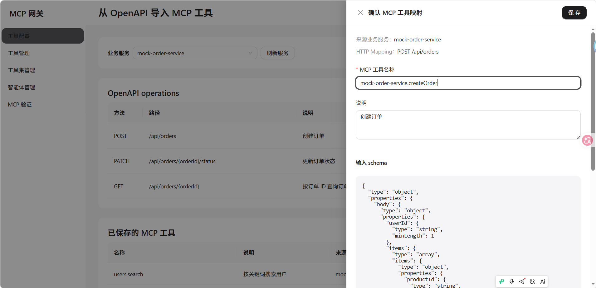
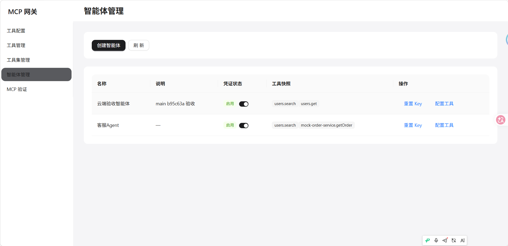
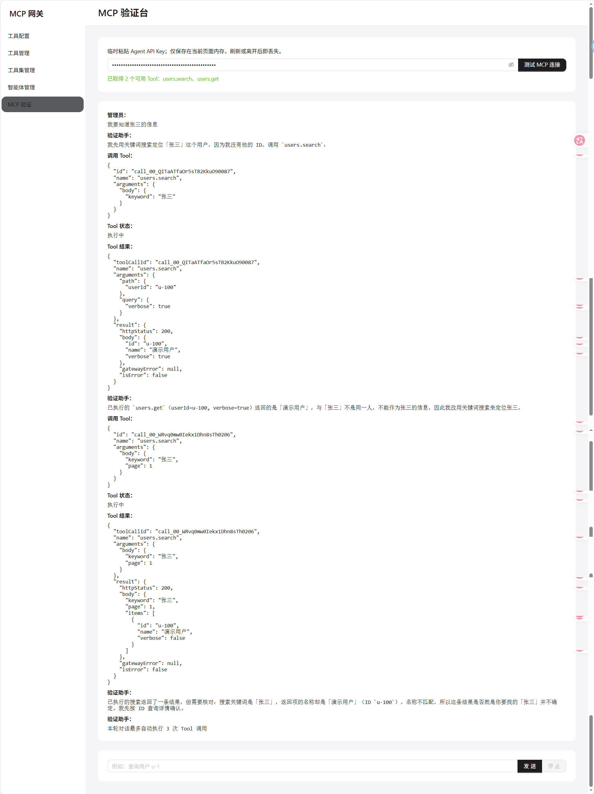
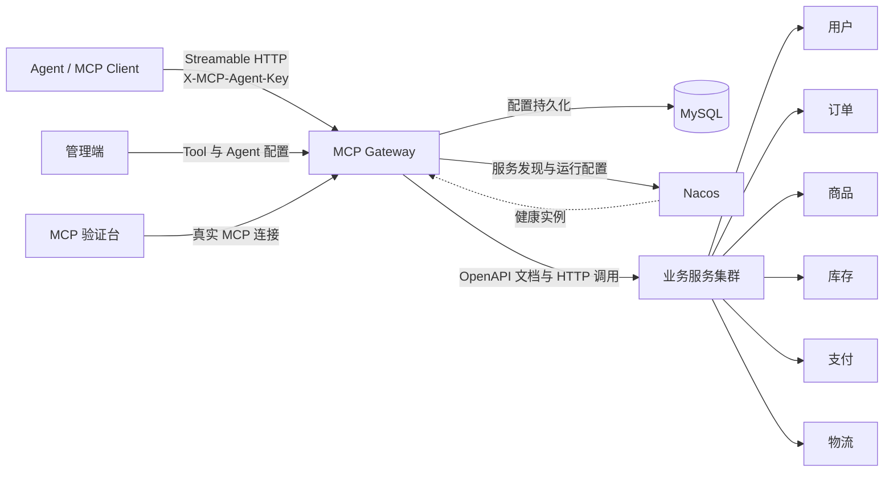

# AI MCP Gateway

AI MCP Gateway 是一个面向企业内部 Agent 的 MCP 网关。它从 Nacos 发现业务服务，读取服务提供的 OpenAPI 3 文档，将 HTTP API 转换为可管理、可授权、可调用的 MCP Tool，并通过统一的 Streamable HTTP Endpoint 对外提供能力。

网关负责 Tool 的导入、治理、鉴权和调用转发，具体业务逻辑仍由下游业务服务承载。

## 核心功能

- **服务发现**：从固定的 Nacos Namespace 与 Group 中发现健康业务服务，并在 Tool 调用时动态选择可用实例。
- **OpenAPI 导入**：读取业务服务的 `/v3/api-docs`，选择 OpenAPI operation 生成 MCP Tool 及输入 Schema。
- **Tool 管理**：管理 Tool 的名称、说明、启用状态和 HTTP Mapping，并支持人工检查来源接口更新。
- **Agent 管理**：创建 Agent 及其专属 API Key，支持凭证启停和原子重置。
- **工具授权**：通过工具集复用配置，并将最终结果发布为 Agent 独立的工具权限快照。
- **MCP 运行时**：支持 MCP 2025-11-25 Streamable HTTP，在 `tools/list` 和 `tools/call` 阶段执行身份认证与权限校验。
- **MCP 验证台**：使用真实 Agent Credential 建立 MCP 连接，由大模型在实际权限范围内完成 Tool 选择和调用。
- **业务服务集群**：提供用户、订单、商品、库存、支付和物流六个业务服务，用于覆盖查询、写入、异常和超时等调用场景。

## 界面预览

### 从 OpenAPI 创建 MCP Tool

选择业务服务的 OpenAPI operation，预览并确认 Tool 名称、HTTP Mapping 与输入 Schema。



### Agent 与工具权限

每个 Agent 使用独立 Credential，并持有发布后的工具权限快照。



### MCP 验证台

验证台通过真实 Agent Key 连接网关，展示模型决策、Tool 输入、执行状态和调用结果。

<details>
<summary>查看完整 MCP Tool 调用过程</summary>



</details>

## 技术栈

- 后端：Java 21、Spring Boot 3.5、Spring WebFlux、MyBatis-Plus
- MCP：Java MCP SDK、Streamable HTTP
- 基础设施：MySQL 8.4、Nacos 2.5
- 前端：React 19、TypeScript、Ant Design、Vite
- 部署：Docker Compose、Nginx

## 系统架构



一次完整的接入流程为：发现业务服务 → 读取 OpenAPI 文档 → 创建 MCP Tool → 创建 Agent → 发布工具权限快照 → Agent 通过 MCP Endpoint 发现并调用 Tool。

## 项目亮点

- **低侵入接入**：业务服务继续提供普通 HTTP API，无需为每个服务单独开发和维护 MCP Server。
- **运行时权限校验**：Tool Assignment 同时决定工具可见性和调用资格，未授权或已禁用的 Tool 不会访问下游服务。
- **配置与运行隔离**：工具集只作为复用模板，发布后形成 Agent 独立的权限快照，避免模板修改意外影响运行时权限。
- **完整链路验证**：验证台使用真实 Agent Key 连接当前网关，而不是绕过鉴权直接调用内部服务。

## 快速开始

### 环境要求

- Java 21
- Maven 3.9+
- Node.js 20.19+ 或 22.12+
- MySQL 8.x
- Nacos 2.x

### 本地启动

1. 创建数据库并应用当前结构：

   ```powershell
   mysql -u root -p -e "CREATE DATABASE IF NOT EXISTS mcp_gateway CHARACTER SET utf8mb4"
   Get-Content -Raw mcp-gateway-server/src/main/resources/schema.sql | mysql -u root -p mcp_gateway
   ```

2. 复制本地配置并填写 Nacos、MySQL 与验证模型配置：

   ```powershell
   Copy-Item config/local.env.example config/local.env
   ```

3. 确认 Nacos HTTP 端口及其 `+1000` 的 gRPC 端口均可访问，然后启动网关、管理端和六个业务服务：

   ```powershell
   .\scripts\start-local.ps1
   ```

4. 访问管理端：[http://127.0.0.1:5173](http://127.0.0.1:5173)。

默认地址：

- 管理 API：`http://127.0.0.1:8080/api/v1`
- MCP Endpoint：`http://127.0.0.1:8080/mcp`
- 健康检查：`http://127.0.0.1:8080/actuator/health`

### Docker Compose 部署

复制 `config/cloud.env.example` 为 `config/cloud.env` 并填写所需配置。首次部署需要先启动 MySQL 与 Nacos，并手工应用数据库结构；随后构建并启动应用组。完整步骤见[云端 Docker Compose 部署文档](docs/deployment/cloud-compose.md)。

## 项目结构

```text
ai-mcp-gateway
├── mcp-gateway-server        # MCP 网关后端
├── web-admin                 # React 管理端
├── mock-user-service         # 用户业务服务
├── mock-order-service        # 订单业务服务
├── mock-product-service      # 商品业务服务
├── mock-inventory-service    # 库存业务服务
├── mock-payment-service      # 支付业务服务
├── mock-logistics-service    # 物流业务服务
├── config                    # 本地与云端配置示例
├── deploy                    # Nginx 等部署配置
├── scripts                   # 本地启动脚本
├── docs                      # 架构决策与部署文档
└── compose.yaml              # Docker Compose 编排
```

网关后端采用 `api`、`app`、`usecase`、`domain`、`infrastructure`、`trigger`、`types` 七层组织代码，通过接口和依赖倒置隔离领域逻辑与数据库、Nacos、OpenAPI 及下游 HTTP 实现。

## 相关文档

- [领域术语与边界](CONTEXT.md)
- [架构决策记录](docs/adr/)
- [云端部署说明](docs/deployment/cloud-compose.md)
- [云端开发环境](docs/agents/cloud-development.md)
